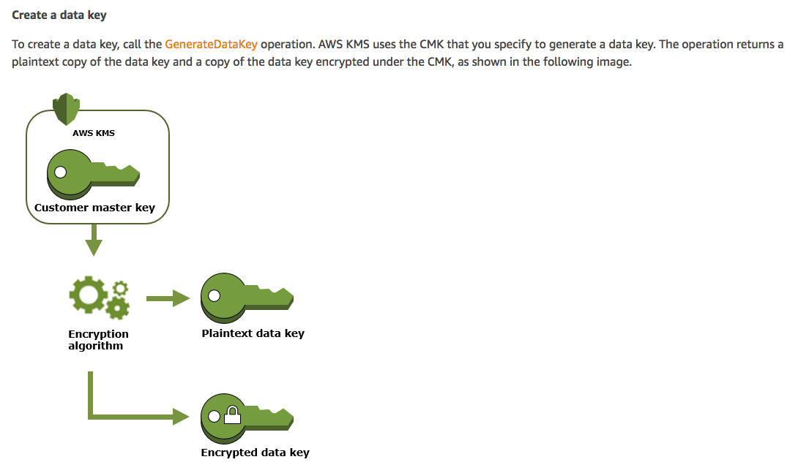

## Client Side Encryption

This workshop demonstrates client side encryption 

## Let's look at some concepts :

 

 

 

### Let's setup the Cloudformation stack required for this workshop :

The above stack creates a cloudwatch event rule used for this workshop to analyze GenerateDataKey API calls

## Let's do some client side encryption

Open the Cloud9 IDE environment called **workshop-environment**. Within the Cloud9 IDE open the bash terminal and change the working directory to **data-protection ** and use the following command to checkout code for this usecase :

**git checkout kms-cse-usecase-3**

Once you run the command above you will see a folder called **usecase-3** in the Cloud9 environment. Follow the steps below :

### Step 1 :

* Run the module named **kms_key_creation-Step-1.py**
* You should see **"KMS Master Key with alias name kms_key_cse_usecase_3 successfully created"** printed
  in the runner window pane below.
* This python module will create a KMS master key with the key alias **kms_key_cse_usecase_3** 
* Browse to the KMS console and you should find the key alias **kms_key_cse_usecase_3** under 
  customer managed keys

### Step 2 :

* You will find a file called ***plaintext_u.txt*** which is the plaintext unencrypted file
* Run the **usecase-3-Step-2.py** python module . The runner pane should print **"Module run was successful !!"**
* The module **usecase-3-Step-2.py** encrypts the ***plaintext_u.txt*** file
* The encrypted file is created and is called ***encrypted_e.txt***
* You should see **"Module run was successful"** printed in the runner window pane below

### Step 3 :

* The encrypted file ***encrypted_e.txt*** is then decrypted 
* The decrypted file is called ***plaintext_u_cycled.txt***

### Step 4 :

* Check whether the***plaintext_u.txt*** and ***plaintext_u_cycled.txt*** have the same content
* This indicates that the client side encryption and then decryption was successful

### Step 5 :

* Wait for 2 minutes
* Run the **check-gendatakey-Step-3.py** python module
* The **check-gendatakey-Step-3.py** is checking for whether a GenerateDataKey API call was logged by cloudtrail
  and this event was then sent to a cloudwatch event rule.
* If all things go well, you should see **"GenerateDataKey API Called"** in the runner window below. If you don'things
  see this print wait for a minute and try again

### Step 6 :

* Run **usecase-3-cleanup-Step-4.py** python module 
* You should see **Cleanup Successful** printed in the runner window pane below
* This modules deletes the kms key and it's alias that we created in **kms_key_creation-Step-1.py**
  .It also deletes all the files that were created in the **usecase-3** folder
* Please remember that every time you run **usecase-3-cleanup-Step-4.py** ,if you want to re-run this uecase,
  you will have to start from **Step 1**

### Some questions to think about :

* Why do we wait for 2 minutes in Step 5 ?
